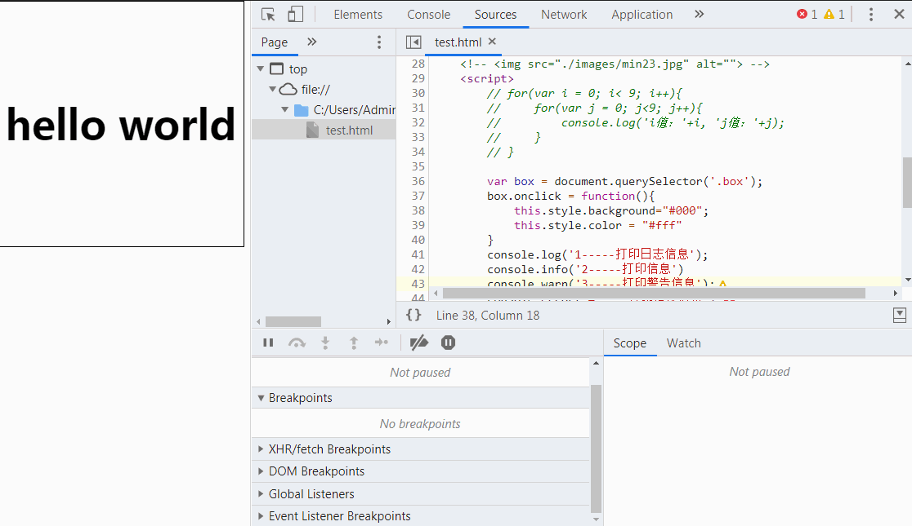

# Chrome 开发工具

### 谷歌浏览器开发者工具打开方式
1. 在网页中通鼠标右键 -> 检查 -> 打开控制台


2. 通过快捷键打开 F12 打开控制台，或者ctrl + shift + i 打开控制台

3. 通过自定义及控制 -> 更多工具 -> 开发者工具


### 选择元素
当在页面中有很多元素时需要找到某个元素时使用。首先点击开发者工具左上角的箭头，在用鼠标点击页面中对应的元素。将会找到对应的元素


### 移动端模拟
点击控制台的左上角一个手机的图标将会把视口改成移动端。可以自己调整手机尺寸


### Elements选项
Elements选项常用来查看元素的样式及元素的位置，以及元素的盒模型。


1. 查看样式对应的文件及对应行数，下图表示该样式书写在 text.html 文件的第8行中


2. 调试元素样式


3. 调整原有颜色值或者是吸取页面中其他颜色值


4. 给元素添加新的类名


5. 查看伪类样式效果


6. 移动及修改元素


### Console选项
用于查看JS打印的代码结果，和显示错误信息，能够直接在控制台输入JS代码

#### 控制台相关API
1. console.assert(表达式, 对象)  ------ 向控制台输出错误
2. console.clear() ------ 清空控制台
3. console.count([标号]) ------ 显示打印的次数，计数器。
4. console.countReset([标号]) ------ 重置计数器。
5. console.debug(object [，object，...]) ------ 打印信息与console.log()一样
6. console.dir(对象) ------ 打印指定对象的JSON表示形式
7. console.dirxml(节点) ------ 打印节点的后代信息
8. console.error(object [，object，...]) ------  打印object到控制台，将其格式化为错误，并包含堆栈跟踪。
9. console.group(标签) ------ 可视化地将消息组合在一起直到console.groupEnd(label)被调用。用于 console.groupCollapsed(label)在最初登录到控制台时折叠组。
	+ 示例： 
	```js
	console.group(label);
	console.info('Leo');
	console.info('Mike');
	console.info('Don');
	console.info('Raph');
	console.groupEnd(label);
	```
10. console.info(object [，object，...]) ------ 与console.log() 方法一样打印日志到控制台
11. console.log(object [，object，...]) ------ 将消息打印到控制台。
12. console.table(数组)  ------ 将对象数组记录为表
13. console.time([标号]) ------ 启动一个新的计时器。调用console.timeEnd([label])停止计时器并将经过的时间打印到控制台。

14. console.trace() ------ 将堆栈跟踪打印到控制台。
	+ 示例：
	```js
	const first = () => { second(); };
	const second = () => { third(); };
	const third = () => { fourth(); };
	const fourth = () => { console.trace(); };
	first();
	```

15. console.warn(object [，object，...]) ------ 向控制台打印警告。


1. 书写JavaScript代码，并运行。如果需要在控制台中换行js代码按 `shift + enter`


2. 控制台信息筛选，打印的每一条信息的尾部会有一个对应信息的文件及行号

;


### Sources选项
sources面板常用于查看目录文件及调试JavaScript代码。


1. 事件断点，对页面的事件进行断点分析，勾选上对应的事件之后就会对页面中所有的该类型的事件进行监听


2. 行断点，给代码的对应行数添加断点调试，并且单行允许代码调试，并且可以在watch书写监听变量


